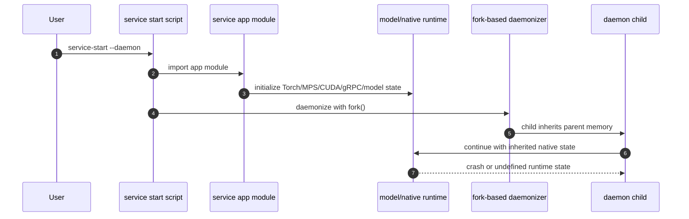
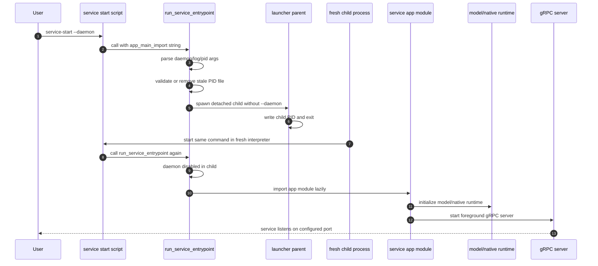

# Daemon Import Caveat

## Summary

Daemon handling must happen before importing service app modules. Several
service apps import model runtimes, native libraries, or even load models at
module import time. If daemonization uses `fork` after those imports, the child
can inherit unsafe native runtime state.

This was observed on macOS with Qwen/MPS:

```text
+[MPSGraphObject initialize] may have been in progress in another thread when fork() was called.
We cannot safely call it or ignore it in the fork() child process. Crashing instead.
```

The generated launcher now provides `run_service_entrypoint(...)` so service
entrypoints can decide daemon mode first, then lazily import the service app.

## Unsafe Import Order



In this flow, the parent imports app/model code before daemon handling. That is
the caveat: even if the service object is constructed later, import-time side
effects may already have touched native runtime state.

## Safe Spawn-Based Order



The important detail is that `app_main_import` is a string, such as
`"app:main"` or `"parakeettranscriptvaserver.app:run"`. The helper imports that
module only after daemon handling has completed.

## Entrypoint Pattern

`app_main_import` is initialized by each service repo entrypoint when it calls
`run_service_entrypoint(...)`. It is not imported at that point; it is just a
string.

For Qwen TTS:

```python
from audiocloneserver.grpc_server_launcher import run_service_entrypoint


def main() -> None:
    run_service_entrypoint(
        app_main_import="app:main",
        injected_command="start",
        default_log_file="qwen3ttsvaserver.log",
        default_pid_file="qwen3ttsvaserver.pid",
    )
```

For Qwen ASR:

```python
from transcribeserver.grpc_server_launcher import run_service_entrypoint


def main():
    run_service_entrypoint(
        app_main_import="qwenasrtranscriptvaserver.app:run",
        default_log_file="qwen_asr_server.log",
        default_pid_file="transcribeserver.pid",
    )
```

For Parakeet:

```python
from transcribeserver.grpc_server_launcher import run_service_entrypoint


def main():
    run_service_entrypoint(
        app_main_import="parakeettranscriptvaserver.app:run",
        default_log_file="parakeet_server.log",
        default_pid_file="transcribeserver.pid",
    )
```

For Vibe:

```python
from audiocloneserver.grpc_server_launcher import run_service_entrypoint


def main() -> None:
    run_service_entrypoint(
        app_main_import="app:main",
        injected_command="start",
        default_log_file="vibevaserver.log",
        default_pid_file="vibevaserver.pid",
    )
```

The helper receives the string as a keyword-only parameter:

```python
def run_service_entrypoint(
    *,
    app_main_import,
    injected_command=None,
    default_log_file="grpc_server.log",
    default_pid_file="audiocloneserver.pid",
):
```

The actual import happens only after the daemon parent branch has returned:

```python
module_name, function_name = app_main_import.split(":", 1)
app_main = getattr(importlib.import_module(module_name), function_name)
app_main()
```

## Rule

Do not import a service app module before daemon handling if the app may import
or initialize model/runtime-heavy dependencies. Keep service entrypoints thin:
they should import only the generated launcher helper, then pass the app entry
as a string.
